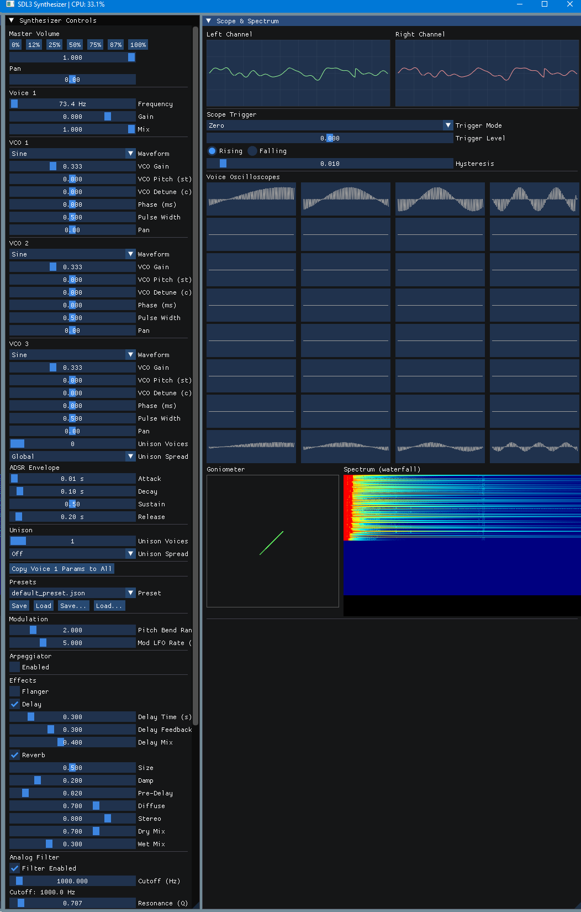

# sdl3-synth

`sdl3-synth` is a powerful, real-time polyphonic synthesizer built in C++ using SDL3 for low-latency audio output and Dear ImGui for an intuitive graphical interface. It features a rich set of synthesis capabilities, including multi-oscillator voices, advanced filtering, extensive effects processing, and full MIDI control. Designed for musicians and sound designers, it offers deep customization for creating diverse sounds from classic analog emulations to modern experimental textures.

## Screenshot



## Features

- **Real-time Audio Synthesis**: Powered by SDL3, providing low-latency audio processing at 48kHz sample rate.
- **Polyphonic Synthesis**: Supports up to 16 voices with advanced voice management and stealing.
- **Multi-Oscillator Architecture**: Each voice features 3 Voltage-Controlled Oscillators (VCOs) with multiple waveforms:
  - Sine, Square, Sawtooth (up/down), Triangle, Pulse, Random noise
- **ADSR Envelope**: Independent Attack, Decay, Sustain, Release envelopes for each oscillator.
- **Unison Mode**: Detunable unison with configurable voice count (1-8) and spread index.
- **Analog Filter**: Second-order low-pass filter with:
  - Adjustable cutoff frequency (20Hz - 20kHz)
  - Resonance (Q factor) for peaking
  - Drive with soft saturation for warmth/distortion
  - Inertial smoothing to prevent zipper noise
  - Oversampling (0x, 2x, 4x, 8x) for aliasing reduction
- **Pitch Bend & Modulation**: Full MIDI pitch bend support with configurable range, plus modulation wheel control.
- **Arpeggiator**: Built-in arpeggiator with:
  - Up, Down, Up-Down, Random directions
  - Adjustable BPM, gate time, octave range
  - Hold mode for sustained patterns
- **Effects Chain**:
  - **Flanger**: Stereo flanging with rate, depth, and mix controls
  - **Delay**: Stereo delay with time, feedback, and mix
  - **Reverb**: Multi-tap reverb with room size, damping, and mix
  - **Compressor**: Bus compression with threshold, ratio, attack/release, and makeup gain
- **Preset System**: Save and load complete synthesizer configurations, including all parameters.
- **Interactive User Interface**: Built with Dear ImGui, providing real-time control over all parameters with sliders, knobs, and combo boxes.
- **MIDI Input Support**: Full MIDI integration via libremidi, supporting note on/off, pitch bend, modulation wheel, and more.
- **Real-time Monitoring**: CPU usage display, voice activity visualization, and FFT-based spectrum analysis.
- **Cross-Platform**: Developed with portable libraries (SDL3, libremidi), compatible across Linux, macOS, and Windows.

## Building

This project uses CMake for its build system and supports both native (desktop) and web (Emscripten) builds.

### Native Build Prerequisites

- A C++ compiler (e.g., GCC, Clang, MSVC)
- CMake 3.15 or higher
- SDL3 development libraries
- OpenGL development libraries
- libremidi development libraries
- Dear ImGui (included as a submodule or external dependency via CMake)

### Web Build Prerequisites

- Emscripten SDK (emsdk)
- CMake 3.15 or higher
- Node.js (for serving the web app)

### Native Build Steps

1. **Clone the repository:**
    ```bash
    git clone https://github.com/koppi/sdl3-synth.git
    cd sdl3-synth
    ```

2. **Configure with CMake:**
    ```bash
    cmake -S . -B build
    ```

3. **Build the project:**
    ```bash
    cmake --build build
    ```

### Web Build Steps

1. **Install Emscripten:**
    Follow the [Emscripten installation guide](https://emscripten.org/docs/getting_started/downloads.html).

2. **Activate Emscripten:**
    ```bash
    source /path/to/emsdk/emsdk_env.sh
    ```

3. **Clone the repository:**
    ```bash
    git clone https://github.com/koppi/sdl3-synth.git
    cd sdl3-synth
    ```

4. **Configure with CMake (for Emscripten):**
    ```bash
    emcmake cmake -S . -B build/web
    ```

5. **Build the project:**
    ```bash
    cd build/web
    make
    ```

This will generate `sdl3-synth.js`, `sdl3-synth.wasm`, and `index.html` in the `build/web` directory.

## Usage

### Native Usage

After building, the executable will be located in the `build/` directory (e.g., `build/sdl3synth`).

```bash
./build/sdl3synth
```

### Web Usage

After building the web version:

1. **Serve the files:**
    ```bash
    cd build/web
    python3 -m http.server 8000
    ```

2. **Open in browser:**
    Navigate to `http://localhost:8000/index.html` in a modern web browser.

The application launches with a comprehensive graphical user interface featuring:

- **Synthesis Controls**: Adjust oscillators, envelopes, unison, and filter parameters in real-time.
- **Effects Rack**: Fine-tune flanger, delay, reverb, and compression settings.
- **Arpeggiator Panel**: Configure rhythmic patterns and playback modes.
- **Preset Management**: Save and load complete synthesizer states.
- **Real-time Monitoring**: View CPU usage, voice activity, and audio spectrum.

For both native and web versions, connect a MIDI device for full control over notes, pitch bend, modulation, and more. The interface updates live, allowing for expressive sound design and performance.

### Web-Specific Notes

- **WebMIDI**: Grant permission when prompted to enable MIDI input.
- **Audio**: The web version uses ScriptProcessorNode (deprecated) for audio output. Future updates may migrate to AudioWorkletNode.
- **WebGL**: Forced to WebGL 1.0 for compatibility.
- **Browser Support**: Tested on Chrome/Chromium. May require enabling experimental features in other browsers.

## Known Issues

- **Web Audio Deprecation**: The web version currently uses the deprecated ScriptProcessorNode. This may be removed in future browser versions.
- **MIDI Initialization**: Occasional runtime errors during MIDI setup in web version; refresh the page if MIDI devices are not detected.
- **Performance**: Web version may have higher latency due to browser limitations.
- **WebGL Warnings**: Some browsers may show WebGL 2 deprecation warnings, but the app forces WebGL 1 for compatibility.

## Dependencies

- [SDL3](https://github.com/libsdl-org/SDL) - Simple DirectMedia Layer 3
- [cJSON](https://github.com/DaveGamble/cJSON) - Ultralightweight JSON parser in ANSI C
- [Dear ImGui](https://github.com/ocornut/imgui) - Bloat-free Immediate Mode Graphical User interface for C++
- [libremidi](https://github.com/atsushieno/libremidi) - A modern, cross-platform C++ MIDI library

## Contributing

Contributions are welcome! Please feel free to open issues or submit pull requests.

## License

This project is licensed under the MIT License - see the `LICENSE.txt` file for details.
